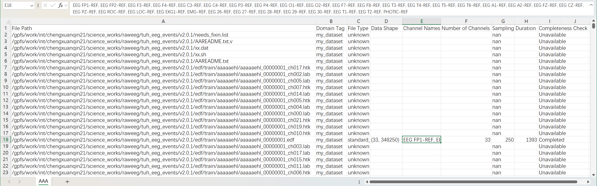
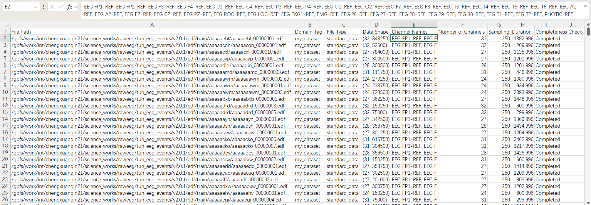
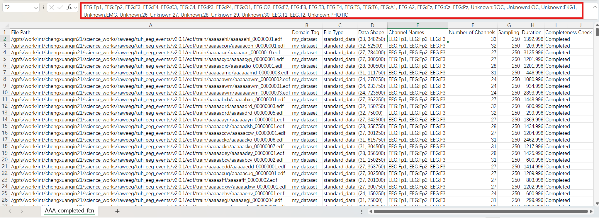

# Formatting Channel Names and Inspecting Metadata

This tutorial shows how to load a dataset, inspect locator metadata, and standardize channel names.

## Requirements

- EEGUnity installed
- A CSV editor (optional) for manual locator inspection

## Step 1: Load the Dataset

```python
from eegunity import UnifiedDataset

input_path = r"path/to/dataset"
ud = UnifiedDataset(dataset_path=input_path, domain_tag="my_dataset")
```

## Step 2: Save the Initial Locator

```python
ud.save_locator(r"./locator/my_dataset_raw.csv")
```

Example locator preview:



## Step 3: Keep Completed Records

```python
ud.eeg_batch.sample_filter(completeness_check="Completed")
ud.save_locator(r"./locator/my_dataset_completed.csv")
```

Example filtered locator preview:



## Step 4: Format Channel Names

```python
ud.eeg_batch.format_channel_names()
ud.save_locator(r"./locator/my_dataset_format_channel_name.csv")
```

Example formatted locator preview:



After formatting, channel names should follow `<Type>:<Name>`, such as `eeg:Fz` or `eog:LOC`.

## Step 5: Manual Correction (Optional)

Open `my_dataset_format_channel_name.csv` and adjust any known metadata issues.

## Step 6: Reload from Locator

```python
ud = UnifiedDataset(locator_path=r"./locator/my_dataset_format_channel_name.csv")
```

When loading from a locator, EEGUnity uses locator metadata as the source of truth.
