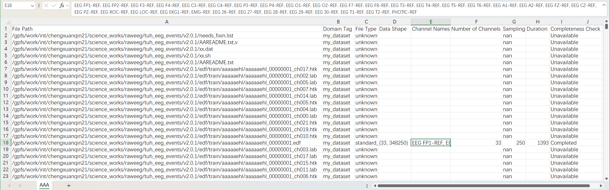
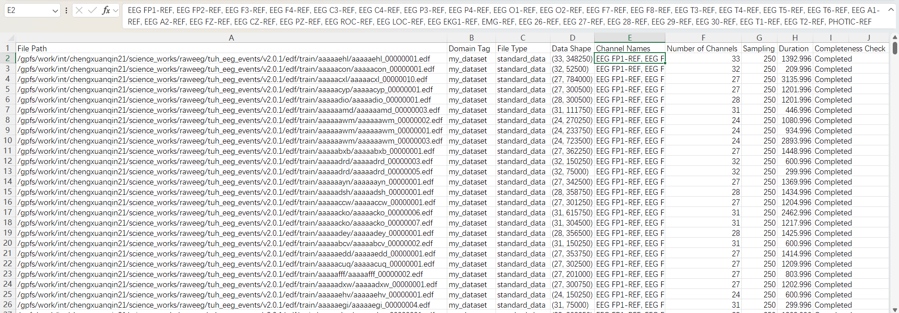
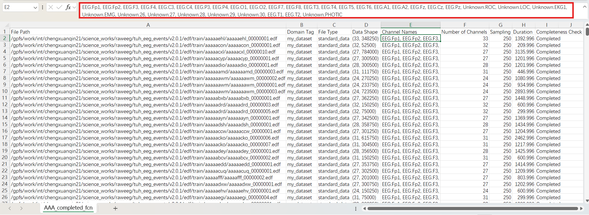

# EEGUnity Tutorial: Formatting Channel Names and Inspecting Metadata

This tutorial guides you through using the EEGUnity library to format channel names and inspect metadata in EEG datasets. By the end of this tutorial, you’ll know how to load a dataset, format channel names, and check metadata correctness.

---

## Requirements
- **EEGUnity** library: Install EEGUnity in your environment.
- **Microsoft Excel** or any CSV editor for inspecting metadata files.

---

## Steps

### Step 1: Load the Dataset
Create an instance of `UnifiedDataset`, specifying the dataset path and a custom tag to represent this data.

```python
from eegunity.unifieddataset import UnifiedDataset
input_path = r'path/to/dataset'  # Specify the directory containing your dataset
unified_dataset = UnifiedDataset(dataset_path=input_path, domain_tag="my_dataset")
```

### Step 2: Save the Initial Locator File
Save the locator file, which stores metadata information about the dataset. This file can be opened in CSV-editing software like Microsoft Excel for easier inspection.
```python
unified_dataset.save_locator(r'./locator/my_dataset_raw.csv')
```
The locator file might look like this:


### Step 3: Select EEG data
Select the data file and save the loactor.
```python
unified_dataset.eeg_batch.sample_filter(completeness_check='Completed')
unified_dataset.save_locator(r'./locator/my_dataset_completed.csv')
```
The locator file might look like this:

### Step 4: Format Channel Names
Standardize the channel names in your dataset by using the `eeg_batch.format_channel_names` method. This ensures that the channel names in your dataset follow a consistent format---`<ChannelType>:<ChannelName>`. In such format, EEGUnity can automatically set channel type and extract its name, when using `get_data_row("is_set_channel_type=True)`.
```python
unified_dataset.eeg_batch.format_channel_names()
unified_dataset.save_locator(r'./locator/my_dataset_format_channel_name.csv')
```
The locator file might look like this:


- **Note**: Open this locator file in Microsoft Excel (or other CSV software) to confirm that the **Channel Names** column has been correctly formatted.
- **Correction**: If you find errors in the metadata, such as incorrect channel names, you can make adjustments directly in the CSV editor (like Microsoft Excel).

### Step 7: Reload the Dataset
Once you have corrected any errors, reload the dataset using the updated locator file. EEGUnity will now compare the locator’s metadata with the raw data. If there are conflicts, EEGUnity prioritizes the locator’s metadata.
```python
unified_dataset = UnifiedDataset(locator_path=r'./locator/my_dataset_format_channel_name.csv')
```

